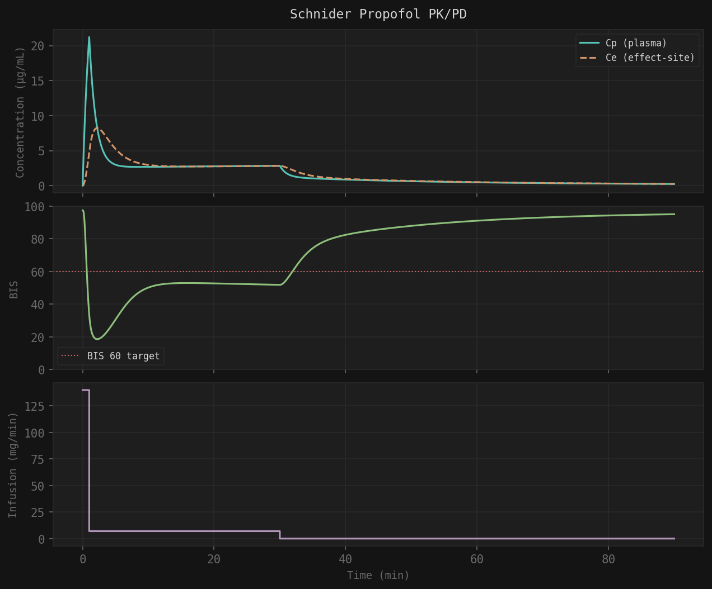
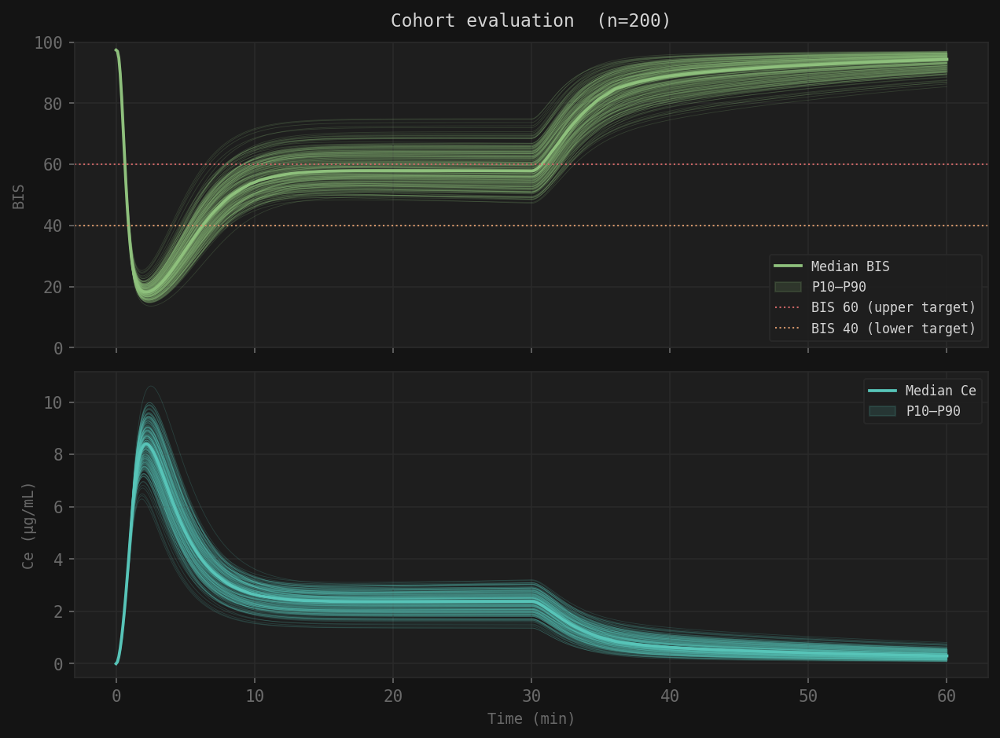
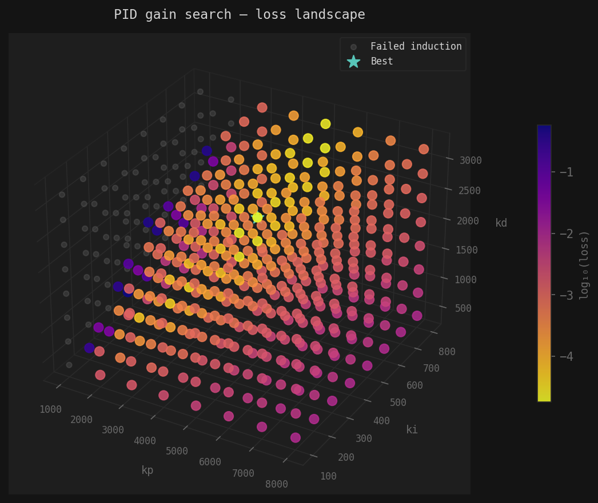
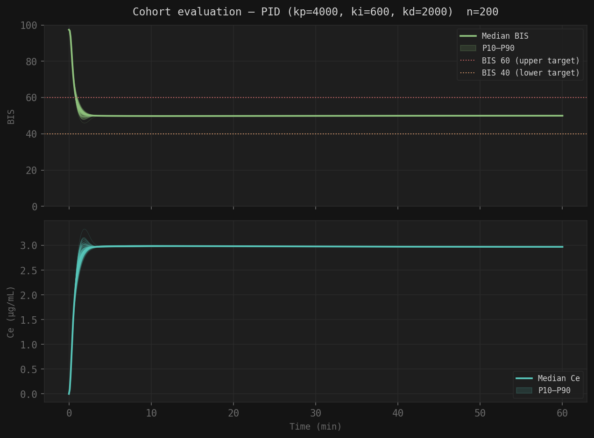

# Schnider Propofol PK/PD Simulator

Example repository for the [Axon](https://runaxon.com) tech blog series on profiling and optimizing physiological models in Python.

---

## What this is

A pure-Python implementation of the **Schnider (1998/1999) propofol pharmacokinetic/pharmacodynamic model** — the same model used in clinical Target Controlled Infusion (TCI) pumps — extended with a virtual patient cohort generator, a closed-loop PID controller, and a grid search optimizer.

The repository accompanies a blog article that walks through:
1. Implementing the physiological model (non-closed form solution)
2. Building a virtual patient cohort via Latin Hypercube Sampling
3. Designing a PID controller and scoring it across the cohort
4. Profiling the bottleneck and transpiling the ODE hot path to C
5. Re-running the grid search with the accelerated simulator

---

## The model

Propofol distributes through the body via a **3-compartment mammillary PK model**: a central compartment (plasma) exchanging drug with a fast peripheral compartment (well-perfused tissue) and a slow peripheral compartment (fat/muscle). Drug effect in the brain is captured by a separate **effect-site compartment** linked to plasma via the equilibration rate constant $k_{e0}$.

The observable output is **BIS** (Bispectral Index) — a processed EEG signal scaled 0–100 that quantifies anesthetic depth. BIS is mapped from effect-site concentration via a sigmoidal Hill equation. The clinical target for general anesthesia is BIS 40–60.

All PK parameters are derived from patient demographics (age, weight, height, sex) using the Schnider population model.

The Schnider model happens to be a linear ODE, thus there is a closed-form solution for Ce(t). However, the purpose of this repo and accompanying article is to show how to speedup PK/PD models that do not have closed-form solutions. Let's pretend like one day a non-linearity will be added to the Schnider model. In that world, we can pretend this RK4 implementation was **not** all for not.



---

## Code structure

```
physio/
    core.py                    # Patient, generic RK4 integrator, simulate(), SimulationResult
    schnider.py                # params_from_patient(), derivatives(), outputs(), mass balance test
    cohort.py                  # Latin Hypercube Sampling cohort generator + JSON persistence

controller/
    pid.py                     # Discrete-time PID with anti-windup and output clamping

cython_ext/
    schnider_cy.pyx            # Typed Cython on derivatives() only — 1.03×
    schnider_full_cy.pyx       # Full C hot path (RK4) — 68×
    schnider_analytical_cy.pyx # Full C hot path (analytical, precomputed Ad/Bd) — 90×
    setup_naive.py             # Build: naive Cython (annotate=True)
    setup_typed.py             # Build: typed derivatives() only
    setup_full.py              # Build: full RK4 C extension
    setup_analytical.py        # Build: analytical C extension

validation/
    closed_form.py             # Analytical solution via matrix exponential (AnalyticalSimulator)
    validate_rk4.py            # Convergence test: RK4 vs analytical, O(dt⁴) confirmed

demo_schnider.py               # Single patient: induction + maintenance + washout
eval_cohort.py                 # Cohort evaluation harness + loss function
mass_balance_test.py           # Mass balance verification (buggy vs fixed Ce ODE)
grid_search.py                 # Pure Python grid search (~185s baseline)
grid_search_fast.py            # RK4 C extension, single process (~2.7s)
grid_search_parallel.py        # RK4 C extension + multiprocessing (~0.6s, 14 cores)
grid_search_analytical.py      # Analytical C extension + multiprocessing (~0.96s, 14 cores)
profile_sim.py                 # cProfile + line_profiler instrumentation

cohorts/                       # Persisted cohort JSON files
results/                       # Grid search results
```

---

## C extensions

Two C extensions are provided, both in `cython_ext/`. All inner functions are `cdef noexcept nogil` — no Python boundary, no GIL, no tuple allocation inside the simulation loop.

### RK4 extension (`schnider_full_cy.pyx`)

| Function | What it does |
|---|---|
| `derivatives_fast` | Schnider ODE right-hand side — 4 compartment equations |
| `rk4_step_cy` | Fixed-step RK4 — calls `derivatives_fast` directly as a C function |
| `bis_fast` | Hill equation: Ce → BIS |
| `pid_step` | Discrete PID with anti-windup — operates on a `cdef struct PIDState` |

The critical design decision: all four functions live in the **same `.pyx` file**. `rk4_step_cy` calls `derivatives_fast` as a direct C call — no Python boundary, no tuple boxing. A separately compiled `derivatives_cy.so` would still pay the Python call overhead 4× per RK4 step, which is why `schnider_cy.pyx` (typed `derivatives` only) yields only 1.03× despite correct typing.

### Analytical extension (`schnider_analytical_cy.pyx`)

Implements the closed-form matrix exponential solution. `Ad = expm(A*dt)` and `Bd = A⁻¹*(Ad-I)*B` are precomputed once per patient, reducing each step to a matrix-vector multiply:

```
x[n+1] = Ad @ x[n] + Bd * u     # 9 multiplies, 6 adds (no ODE evaluation)
```

Ce coefficients are also precomputed analytically. Per-patient compute is 1.27× faster than the RK4 extension.

### Building

```bash
python cython_ext/setup_full.py build_ext --inplace        # RK4
python cython_ext/setup_analytical.py build_ext --inplace  # Analytical
```

Requires Cython and a C compiler (`clang` on macOS, `gcc` on Linux).

### Speedup summary

| | Grid search time | Speedup |
|---|---|---|
| Pure Python | 185.2s | 1.0× |
| Naive Cython | 174.6s | 1.06× |
| Typed Cython (`derivatives` only) | 178.9s | 1.03× |
| Full C RK4 (`rk4_step` + `derivatives`) | 54.7s | 3.4× |
| Full C RK4 + PID + Hill + scalar mode | 2.7s | 68× |
| Full C RK4 + parallel (14 cores) | 0.6s | 308× |
| Analytical C (precomputed Ad/Bd) | 2.05s | 90× |
| Analytical C + parallel (14 cores) | **0.96s** | **193×** |

Note: parallel analytical is slower than parallel RK4 at this grid size because process startup and IPC dominate. Pure compute favors analytical by 1.4×.

### Running the grid searches

```bash
python grid_search_fast.py                        # RK4, single process
python grid_search_parallel.py --workers 14       # RK4, parallel
python grid_search_analytical.py --workers 14     # Analytical, parallel
```

---

## Validation

### Mass balance

`mass_balance_test.py` verifies drug conservation. Compares the buggy Ce ODE (`dxe_dt = ke0*(x1-xe)`, which mixes amounts and concentrations) against the correct one (`dCe_dt = ke0*(C1-Ce)`). The buggy version creates phantom drug mass — confirmed by including `xe` in the amount sum.

```bash
python mass_balance_test.py
```

### RK4 convergence

`validation/validate_rk4.py` compares RK4 against the closed-form analytical solution at decreasing step sizes. Confirms O(dt⁴) convergence. At the default `dt=0.1 min`, max Cp error is 1e-5 µg/mL — seven orders of magnitude below the therapeutic signal (~3 µg/mL).

```bash
python validation/validate_rk4.py
```

---

## Setup

```bash
python3 -m venv .venv
source .venv/bin/activate
pip install -r requirements.txt
```

---

## Single patient demo

```bash
python demo_schnider.py
```

Simulates a 70 kg / 40 yr male receiving a standard induction bolus + 30 min maintenance + washout. Saves `schnider_demo.png`.

---

## Virtual cohort

Patient demographics are sampled via **Latin Hypercube Sampling** over the ranges below, which reflect the adult surgical population studied in Schnider (1998):

| Variable | Range |
|----------|-------|
| Age | 18 – 80 years |
| Weight | 50 – 120 kg |
| Height | 150 – 195 cm |
| Sex | 50% male / 50% female |

LHS guarantees uniform coverage across every dimension — no clustering, no gaps — with far fewer samples than pure random sampling.

```bash
# Generate and persist a cohort
python eval_cohort.py --generate --n 200 --seed 99 --out cohorts/n200_seed99.json

# Evaluate open-loop
python eval_cohort.py --cohort cohorts/n200_seed99.json
```



The 3.5× spread in metabolic clearance (CL1: 1.3–4.5 L/min) across the cohort means the same fixed infusion schedule produces meaningfully different anesthetic depth in different patients. The controller must compensate.

---

## Loss function

Controller performance is scored by a normalized cohort loss:

$$\tilde{L} = \frac{1}{N} \sum_{n=1}^{N} \left( \frac{ISE_n}{ISE_{ref}} + \tilde{P}_n \right)$$

- **ISE** is the Integral Squared Error between BIS and target (50), computed over the maintenance window only (t = 2–30 min). Normalized by $ISE_{ref} = 50^2 \times 28 = 70{,}000$ so the score is in [0, 1] regardless of window length or cohort size.
- **Induction penalty** fires if BIS has not crossed below 60 within 2 minutes — the clinical standard for propofol induction. Adds ~7.14 per failed patient.

| Scenario | Loss |
|----------|------|
| Open-loop baseline | 0.1000 |
| Optimized PID | 0.0000179 |
| Improvement | **5,600×** |

---

## PID controller

The controller observes BIS at each time step and outputs an infusion rate. Error is defined as `measurement - setpoint` (positive when BIS is above target, driving higher infusion).

```python
from controller.pid import PIDController

pid = PIDController(kp=4000, ki=600, kd=2000, setpoint=50, dt=0.1)
pid.reset()

rate = pid.step(bis_measurement)  # returns µg/min
```

Key implementation details:
- **Anti-windup**: integral is frozen when output is saturated (at max or min rate)
- **Derivative on measurement**: avoids derivative kick if setpoint changes mid-case
- **Output clamped** to [0, max_rate] — negative infusion rates are physically impossible

---

## Grid search

```bash
# Pure Python (~185s — the baseline for the profiling story)
python grid_search.py --cohort cohorts/n200_seed99.json

# RK4 C extension, single process (~2.7s)
python grid_search_fast.py

# RK4 C extension + multiprocessing (~0.6s on 14 cores)
python grid_search_parallel.py --workers 14

# Analytical C extension + multiprocessing (~0.96s on 14 cores)
python grid_search_analytical.py --workers 14
```

Searches 512 candidates ($8^3$ grid) centered on the known optimum region. Each candidate runs all 200 patients in closed-loop.

**512 candidates × 200 patients = 102,400 simulations — 185 seconds in pure Python, under 1 second with the C extension and 14 cores.**

Best gains found: `kp=4000, ki=600, kd=2000`



---

## Closed-loop cohort evaluation

```bash
python eval_cohort.py --cohort cohorts/n200_seed99.json --pid 4000,600,2000
```



With the optimized gains, all 200 patients are held within **0.7 BIS points** of the target (median nadir 49.8, P10–P90: 49.3–49.9). Compare to the open-loop spread of 15.7–20.9.

---

## Use the model directly

```python
from physio.core import Patient
from physio.schnider import simulate

patient = Patient(age=55, weight=80, height=175, sex='female')

schedule = [
    (0.0,  160_000.0),  # induction (µg/min)
    (1.0,    8_000.0),  # maintenance
    (45.0,       0.0),  # stop
]

result = simulate(patient, schedule, duration=90.0, dt=0.1)

# result.time  — list of time points (min)
# result.cp    — plasma concentration (µg/mL)
# result.ce    — effect-site concentration (µg/mL)
# result.bis   — BIS score (0–100)
```

---

## References

- Schnider TW et al. *The influence of age on propofol pharmacokinetics.* Anesthesiology 1998; 88(5):1170–82 — PK parameters (V1, V2, V3, CL1, CL2, CL3)
- Schnider TW, Minto CF et al. *The influence of age on propofol pharmacodynamics.* Anesthesiology 1999; 90(6):1502–16 — ke0 = 0.456 min⁻¹
- Eleveld DJ et al. *Pharmacokinetic–pharmacodynamic model for propofol for broad application in anaesthesia and sedation.* Br J Anaesth 2018; 120:942–959 — BIS PD parameters (e0, emax, ec50, gamma)
- James WPT. *Research on obesity.* HMSO, London, 1976 — LBM formula
- McKay MD, Beckman RJ, Conover WJ. *A comparison of three methods for selecting values of input variables in the analysis of output from a computer code.* Technometrics 1979; 21(2):239–45 — Latin Hypercube Sampling
